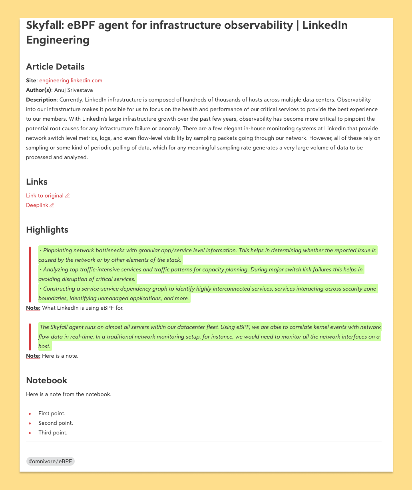

# omnivore-to-bear
Tool that exports your [Omnivore](https://omnivore.app/home) articles to [Bear](https://bear.app).


## Prerequisites
* Bear must be installed and you must be logged in.
* Omnivore account.
* Omnivore API key.

## Usage
```sh
bun install && bun index.ts --api-key=<MY_OMNIVORE_API_KEY>  --from-scratch=true --archived-only=true --parent-tag=omnivore
```

## Arguments
| Arg                      | Description                                                                                                                    | Mandatory | Default    |
|--------------------------|--------------------------------------------------------------------------------------------------------------------------------|-----------|------------|
| **--api-key**            | Omnivore API key.                                                                                                              | Y         | N/A        |
| **--from-scratch**       | Clean up the database so the export starts all over again. **!!! Please note that it can lead to duplicate notes in Bear !!!** | N         | `false`    |
| **--archived-only**      | Only **archived** articles from Omnivore.                                                                                      | N         | `false`    |
| **--parent-tag**         | Defines the parent tag to be used to organize articles in Bear                                                                 | N         | `omnivore` |

## Shortcomings
### x-callback-url
Bear does not provide us with a "proper" API, it uses the [x-callback-url protocol](https://x-callback-url.com/specification/) instead. This prevents us from easily correlating data.

As a result, In Bear, exported articles are identified by their titles.

### Article Deletion
At the moment, this tool doesn't support deleting Omnivore articles previously exported to Bear and deleted in Omnivore afterward.

## Example
Here is what an exported article looks like once exported to Bear:


